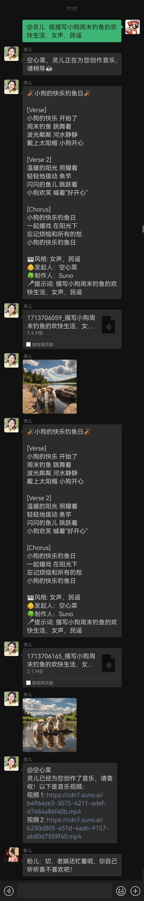
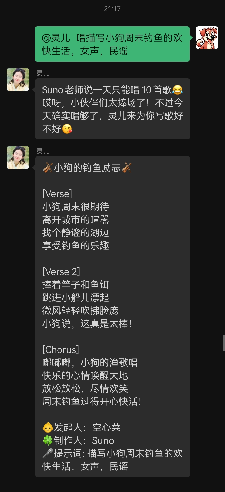

# Nicesuno

一款基于[Suno](https://suno.com/)和[Suno-API](https://github.com/SunoAI-API/Suno-API)创作音乐的chatgpt-on-wechat插件。

+ 使用方法：
```
1.创作声乐
用法：唱/演唱<提示词>
示例：唱明天会更好。

2.创作器乐
用法：演奏<提示词>
示例：演奏明天会更好。

3.创作歌词
用法：写歌/作词<提示词>
示例：写歌明天会更好。

4.自定义模式
用法：
唱/演唱/演奏
标题: <标题>
风格: <风格1> <风格2> ...
<歌词>
备注：前三行必须为创作前缀、标题、风格，<标题><风格><歌词>三个值可以为空，但<风格><歌词>不可同时为空！
```

## 插件效果

1. 创作音乐



2. Suno超过限额之后，仅创作歌词



## 安装方法

**1. 浏览器访问[Suno](https://suno.com/)，获取当前账户的`session_id`和`Cookie`。**

+ 浏览器访问并登录Suno：https://suno.com/
+ 按F12键打开开发者工具，选择“网络”标签；
+ 稍等一分钟就会出现类似`tokens?_clerk_js_version=4.72.0-snapshot.vc141245`的请求，获取该Request URL中的`Session_id`以及`Cookie`；
+ `Session_id`获取示例：比如这里的Request URL为`https://clerk.suno.com/v1/client/sessions/sess_xeNbYcD4zOK89Vzwipl30x5gWq3/tokens?_clerk_js_version=4.72.0-snapshot.vc141245`，则`Session_id`是`sess_xeNbYcD4zOK89Vzwipl30x5gWq3`。

**2. 部署SunoAI-API**

+ 详细的安装和配置步骤参考[Suno-API](https://github.com/SunoAI-API/Suno-API)，这里只给出大致步骤：
```shell
# 克隆代码
git clone https://github.com/SunoAI-API/Suno-API.git

# 配置Suno-API，首先拷贝模板文件.env.example到.env
cd Suno-API
cp .env.example .env
# 然后编辑.env文件，将其中的SESSION_ID和COOKIE两个环境变量的值，分别替换为步骤1中获取的Session_id和Cookie
BASE_URL=https://studio-api.suno.ai
SESSION_ID=将我替换为步骤1中获取的Session_id
COOKIE=将我替换为步骤1中获取的Cookie

# 安装依赖
pip3 install -r requirements.txt

# 运行程序
nohup uvicorn main:app &>> Suno-API.log &

# 查看日志
tail -f Suno-API.log
```

**3. 安装Nicesuno插件**

```sh
#installp https://github.com/wangxyd/nicesuno.git
#scanp
```
+ Nicesuno的默认配置无需修改，即可使用Suno创作音乐。

## Nicesuno自定义配置

+ 如果需要自定义配置，可以按照如下方法修改：
```shell
# 拷贝模板文件config.json.template到config.json
cp config.json.template config.json
# 编辑config.json
{
  "suno_api_bases": ["http://127.0.0.1:8000"],
  "music_create_prefixes": ["唱", "演唱"],
  "instrumental_create_prefixes": ["演奏"],
  "lyrics_create_prefixes": ["写歌", "作词"],
  "music_output_dir": "/tmp/nicesuno",
  "is_send_lyrics": true,
  "is_send_covers": true
}
```

以上配置项中：

- `suno_api_bases`: Suno-API的监听地址和端口，注意该参数的值为一个字符串数组，后续用于实现自动切换Suno账号；
- `music_create_prefixes`: 创作声乐的消息前缀，注意该参数的值为一个字符串数组；
- `instrumental_create_prefixes`: 创作器乐的消息前缀，注意该参数的值为一个字符串数组；
- `lyrics_create_prefixes`: 创作歌词的消息前缀，注意该参数的值为一个字符串数组；
- `music_output_dir`: 创作的音乐的存储目录，默认为`/tmp/nicesuno`；
- `is_send_lyrics`: 是否获取并发送歌词，默认为`true`；
- `is_send_covers`: 是否下载并发送封面，默认为`true`。

有更好的想法或建议，欢迎积极提出哦~~~